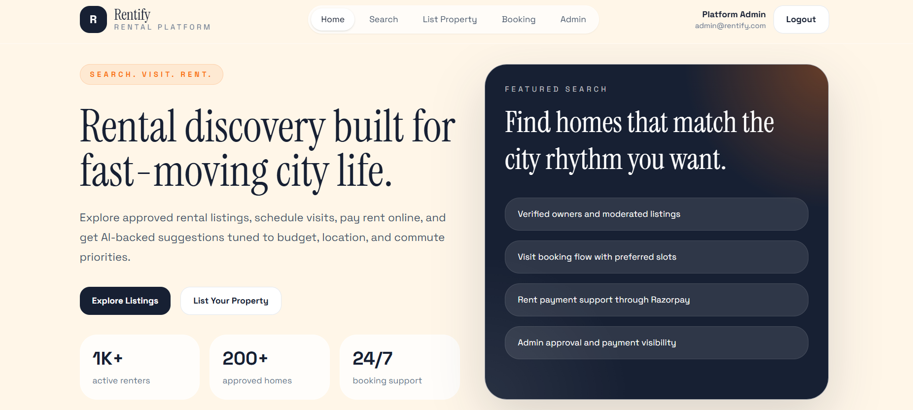
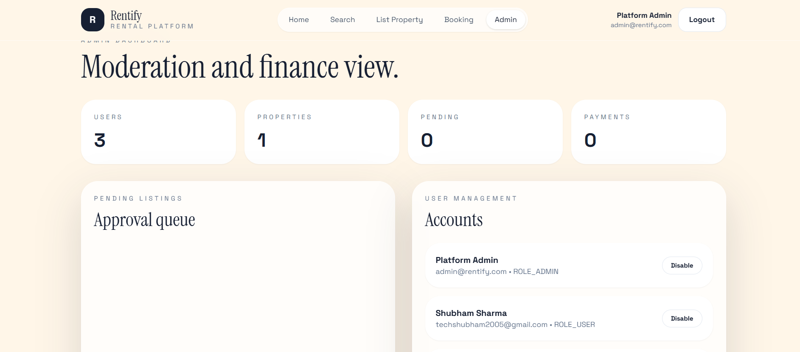
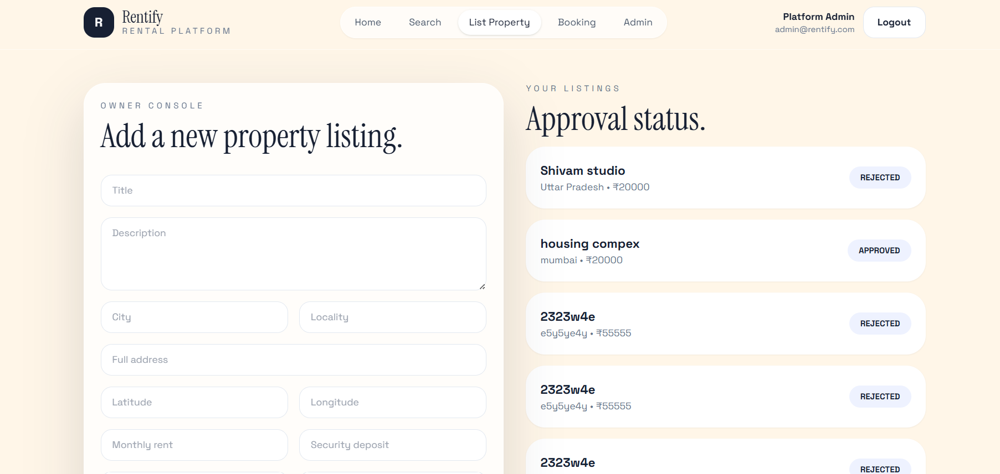
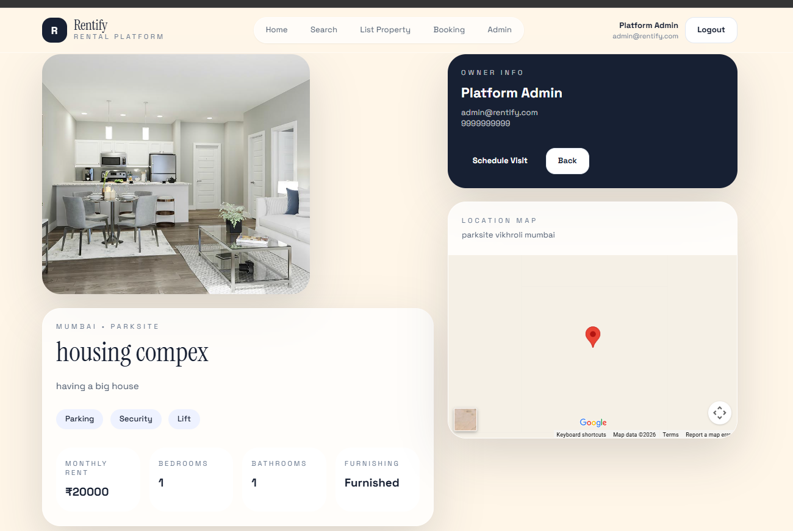
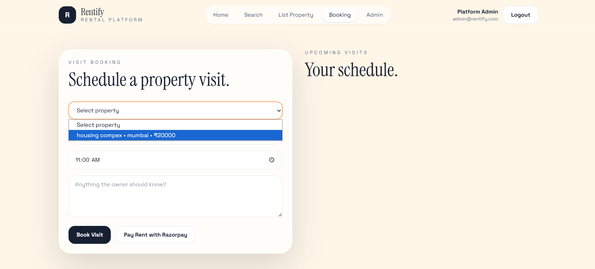

# Rentify

Full-stack rental property platform inspired by MagicBricks, built with React, Tailwind CSS, Spring Boot, Spring Security, JWT, MySQL, Razorpay, and AI recommendations through a configurable GPT provider.

## Stack

- Frontend: React 19, Vite, Tailwind CSS, Axios, React Router
- Backend: Java 17, Spring Boot 3, Spring Security, JWT, Spring Data JPA, Swagger
- Database: MySQL 8
- Payments: Razorpay order creation + signature verification
- AI: RapidAPI/OpenAI-style provider integration through env config
- DevOps: Docker, Docker Compose, `.env`-based configuration

## Folder Structure

```text
.
├── backend
│   ├── src/main/java/com/rental/platform
│   │   ├── config
│   │   ├── controller
│   │   ├── dto
│   │   ├── exception
│   │   ├── model/entity
│   │   ├── model/enums
│   │   ├── repository
│   │   ├── security
│   │   └── service
│   ├── src/main/resources/application.yml
│   └── Dockerfile
├── frontend
│   ├── src
│   │   ├── api
│   │   ├── components
│   │   ├── pages
│   │   └── state
│   ├── Dockerfile
│   └── nginx.conf
├── database/schema.sql
├── docker-compose.yml
└── .env.example
```

## Features

- JWT signup/login with admin seeding
- Property listing creation with image upload
- Public property search with city, price, bedroom, and furnishing filters
- Property detail page with photos, owner details, and embedded map
- Visit booking workflow for authenticated users
- Rent payment order creation and verification via Razorpay
- AI recommendation endpoint and frontend panel
- Admin dashboard for approvals, users, and payments
- Swagger docs at `http://localhost:8080/swagger-ui.html`

## Environment

1. Read `.env`.
2. Fill in `RAZORPAY_KEY_ID`, `RAZORPAY_KEY_SECRET`, and `RAPIDAPI_KEY`.
3. Keep `RAPIDAPI_HOST=chatgpt-42.p.rapidapi.com`.
4. If your RapidAPI subscription uses a different route than `/chat`, change `AI_API_URL`.

## Local Run

### Backend

```bash
cd backend
mvn spring-boot:run
```


```bash
cd backend
mvn spring-boot:run -Dspring-boot.run.profiles=local
```

### Frontend

```bash
cd frontend
npm install
npm run dev
```

### Docker

```bash
docker compose up --build
```

## Default Admin

- Email: `admin@rentify.com`
- Password: `admin123`

Override both in `.env` before deployment.

## Core API Endpoints

- `POST /api/auth/signup`
- `POST /api/auth/login`
- `GET /api/auth/me`
- `GET /api/properties`
- `GET /api/properties/{id}`
- `POST /api/properties`
- `GET /api/properties/owner/mine`
- `POST /api/bookings`
- `GET /api/bookings/mine`
- `POST /api/payments/order`
- `POST /api/payments/verify`
- `POST /api/ai/recommendations`
- `GET /api/admin/dashboard`
- `PATCH /api/admin/properties/{id}/approval`

## AI Integration Example

Request:

```json
{
  "city": "Navi Mumbai",
  "budget": 15000,
  "bedrooms": 1,
  "furnished": true,
  "preferences": ["metro", "office commute", "gated society"]
}
```

Response shape:

```json
{
  "summary": "Recommended properties in Navi Mumbai under INR 15000 include 3 shortlisted options.",
  "recommendedProperties": []
}
```

The backend first filters approved properties from MySQL, then optionally calls the configured external GPT endpoint to generate a short recommendation summary.

## Notes

- Uploaded images are stored locally in `uploads/`.
- The frontend expects the backend on `http://localhost:8080` by default.
- `database/schema.sql` documents the full MySQL schema and is mounted into MySQL in Docker.
- The AI provider response parser is tolerant because RapidAPI GPT wrappers do not all return the same JSON shape.

  ## 📸 Project Screenshots

### 🏠 Home Page


### 🔐 Admin Dashboard


### 🏢 Property Listing


### 🏡 Property Details


### 💳 Booking & Payment (Razorpay)


### 🏘️ Apartment View

